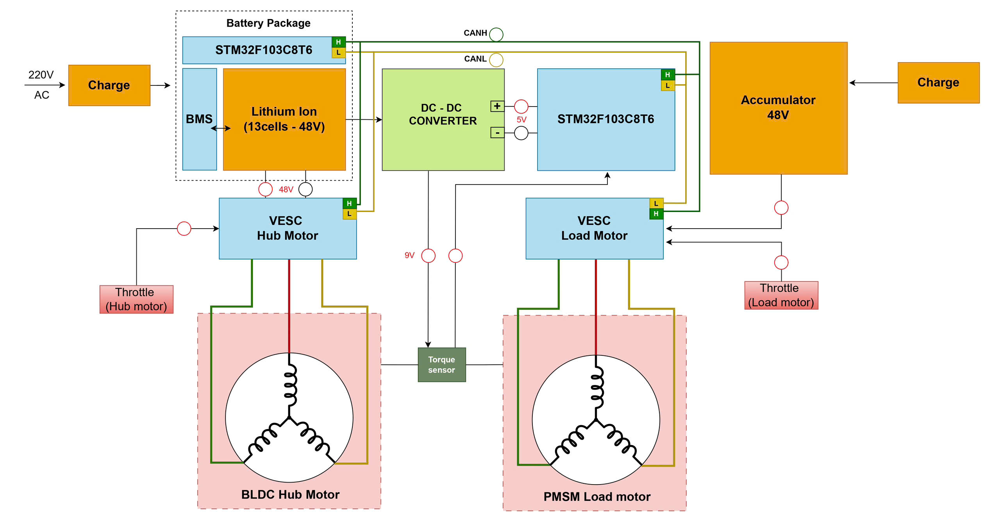
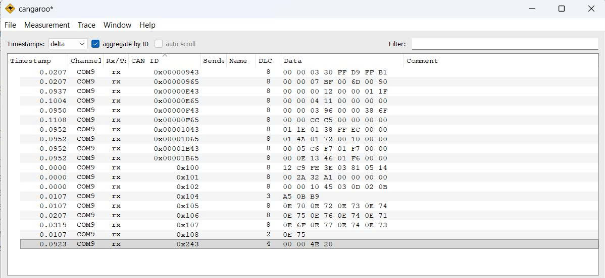
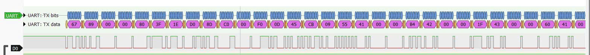
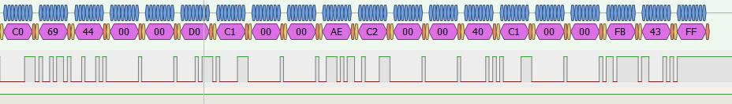
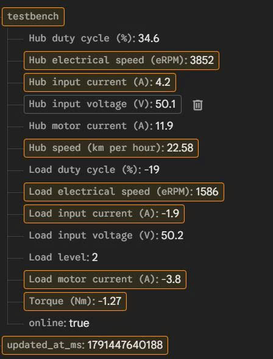
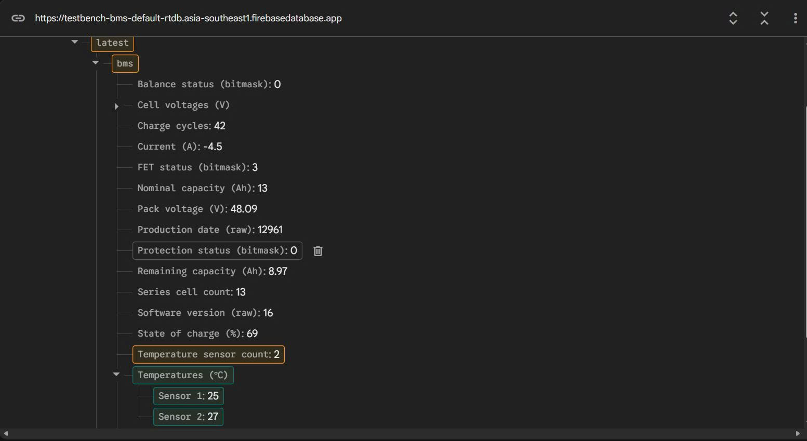

# RTOS Test Bench and BMS Telemetry Gateway

Dự án tích hợp dữ liệu Test Bench và BMS trên STM32F103CBT6.
MCU nhận thông tin vận hành từ hệ thống Test Bench và dữ liệu BMS,
xử lý chúng theo các task FreeRTOS, sau đó truyền một frame UART
171 byte đến ESP32-S3. ESP32 giải mã frame và cập nhật dữ liệu lên
Firebase Realtime Database.

FreeRTOS được dùng để tổ chức riêng việc xử lý yêu cầu thay đổi tải,
thu nhận/giải mã dữ liệu và đóng gói/truyền telemetry. Việc đồng bộ
với DMA UART giúp task truyền chỉ tiếp tục khi quá trình truyền trước
đã hoàn tất.

## 1. Sơ đồ hệ thống

## 2. FreeRTOS Task Architecture

| Task          | Priority      | Nhiệm vụ                                                                          |
|---------------|---------------|---------------------------------------------------------------------------------- |
| Task User     | 3             | Đọc công tắc chọn tải, cập nhật mức tải và gửi lệnh hãm đến VESC của Load motor   |
| Task_Decode   | 2             | Xử lý dữ liệu CAN của TestBench và BMS, chuyển đổi dữ liệu ADC của cảm biến mô-men|
| Task_Encode   | 2             | Đóng gói dữ liệu TestBench và BMS thành frame UART truyền đến ESP32 sử dụng DMA   |

Task_User được sử dụng ở mức ưu tiên cao nhất do người sử dụng tác động trực tiếp 
Task_Decode sử dụng queue, triển khai xử lí ngắt CAN và truyền dữ liệu vào Queue để xử lí dữ liệu trong Task
Task_Encode sử dụng Semaphore binary để đồng bộ truyền UART_DMA sau khi đóng gói dữ liệu

## 3. Inter-Task Communication and Synchronization

### Queue

Hàm nhận ngắt của CAN, hay còn gọi là USB_LP_CAN1_RX0_IRQHandler() sẽ gửi frame data (gồm có dữ liệu VESC, BMS,..) vào trong queue, và task decode sẽ đảm nhận

### Semaphore

Task encode dùng binary semaphore để đồng bộ với DMA truyền UART. Khi lấy được semaphore, task đóng gói dữ liệu thành frame rồi khởi động DMA chuyển dữ liệu từ RAM sang UART. Khi DMA hoàn tất, ISR trả semaphore để cho phép task dùng lại buffer cho lần truyền tiếp theo

## 4. Kết quả thực tế

